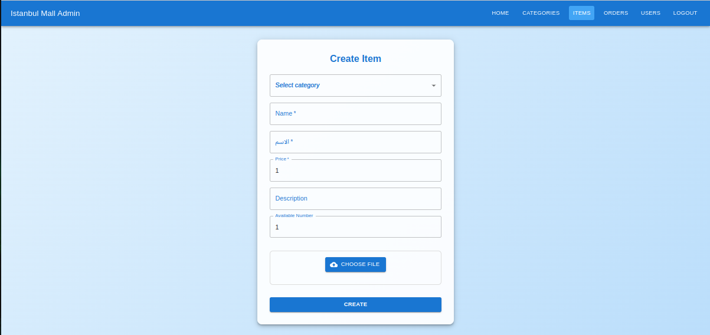
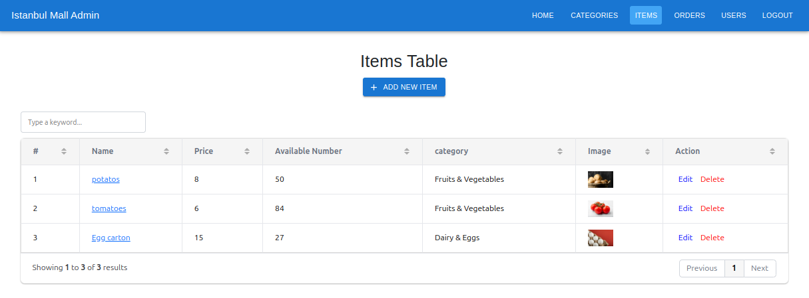
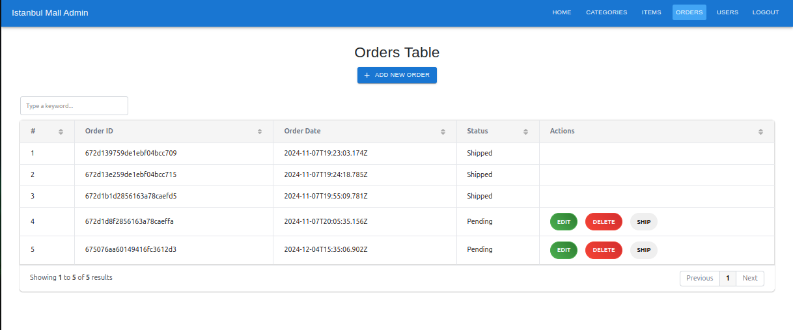
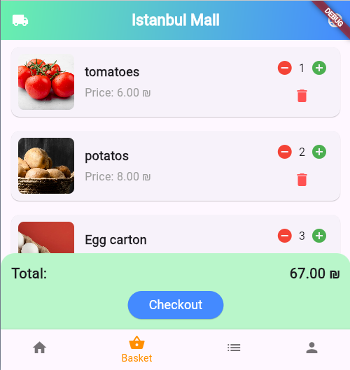
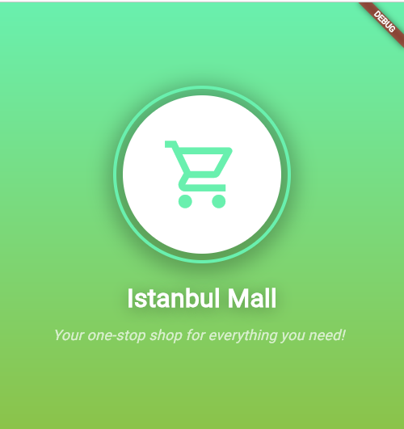
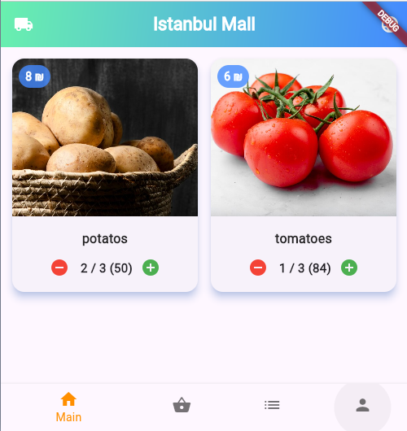
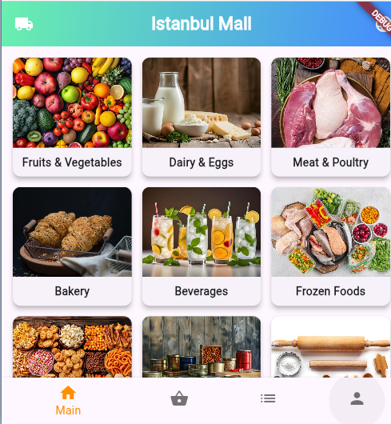

# 🏬 **Istanbul Mall** - The Ultimate Shopping Experience

Welcome to **Istanbul Mall**, an online platform that brings the vibrant and diverse shopping experience of Istanbul to your fingertips! Whether you're browsing for the latest fashion trends, exploring local goods, or discovering new cuisines, Istanbul Mall is your one-stop digital destination.

---

## 🌟 **Key Features**

- **Product Catalog**: Browse a wide range of products, including clothing, accessories, electronics, and more.
- **Search & Filters**: Quickly find exactly what you're looking for with advanced search and filtering options.
- **User Accounts**: Create and manage your account, track orders, and save your favorite items.
- **Shopping Cart**: Seamlessly add products to your cart, view pricing, and check out with ease.
- **Order Management**: Track your orders in real-time and manage your purchase history.
- **Store Locator**: Find physical mall locations, get directions, and explore in-store promotions.
- **Responsive Design**: A modern and intuitive user interface designed to work seamlessly across all devices.
- **AWS S3 Integration**: Save product images and other media to AWS S3 for scalable and reliable storage.

---

## 💻 **Tech Stack**

- **Frontend (Admin Site)**:
  - **React.js**: For building a fast, interactive, and dynamic admin dashboard.
  - **Material UI**: For a modern design and responsive components.
  - **Axios**: For API calls and fetching data from the backend.

- **Frontend (Client App)**:
  - **Flutter**: For building a cross-platform mobile app with a smooth, native-like user experience.
  - **Dio**: For handling HTTP requests in Flutter.

- **Backend**:
  - **Node.js** and **Express.js**: For a fast, scalable backend to serve the platform.
  - **MongoDB**: For efficient, flexible data storage.
  - **AWS S3**: For storing product images and other media in the cloud.
  - **JWT** (JSON Web Tokens): For secure user authentication.

- **DevOps**:
  - **Docker**: For containerizing the app and easy deployment.
  - **AWS EC2**: For cloud hosting.

- **Version Control**:
  - **GitHub**: For managing the codebase and collaborating with contributors.

- **Tools**:
  - **AWS S3**: For storing images and other media files. AWS S3 provides scalable object storage for applications, ensuring high availability and security for uploaded images.
  - **AWS SDK**: To interact with AWS S3 from your Node.js backend, enabling easy upload, retrieval, and management of files.

---

## 🖼️ **Screenshots**

Here are some screenshots of the **Istanbul Mall** platform:

- **Admin Dashboard**  
  

- **Item Management**  
  

- **Order Management**  
  

- **Shopping Cart**  
  

- **Entry Page**  
  

- **Product Listings**  
  

- **Main Page**  
  

- **Order Overview**  
  

---

## 🚀 **Installation & Setup**

To get started with **Istanbul Mall** locally on your machine, follow these steps:

### 1. Clone the Repository
```bash
git clone https://github.com/username/e-commerce.git
cd e-commerce
